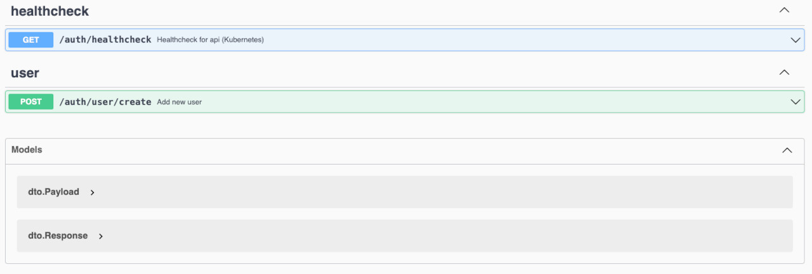

# auth-service


An example of an authorization microservice in Go according to DDD with EDA in a kubernetes cluster.

## Quick Links
| Link | Description | Credential |
|------|-------------|------------|
|http://localhost:8080 | local development | air-verse |
|http://localhost:50015 | local development | minikube |
|http://localhost:8080/v1/swagger-ui/ | local swagger | swagger |
|[Repositry Link](https://github.com/go-chi/chi) | router framework pkg | go-chi/chi |
|[Repositry Link](https://github.com/joho/godotenv) | env files loader pkg | joho/godotenv |
|[Repositry Link](https://github.com/golang-migrate) | postgre migration pkg | golang-migrate |
|[Repositry Link](https://pkg.go.dev/google.golang.org/grpc) | gRPC package | google.golang.org/grpc |
|[Repositry Link](https://github.com/go-playground/validator) | validation pkg | go-playground |
|[Repositry Link](https://github.com/jackc/pgx) | postgresql driver pkg | jackc/pgx |
|[Repositry Link](https://github.com/swaggo/http-swagger) | http-swagger pkg |swaggo/http-swagger |


## Development
### Overview and local setup
This Go project is structured as follows:

```
├── auth-service
│   ├── bin
│   │   └── *                         # Compiled binary
│   ├── cmd
│   │   └── api
│   │        ├── main.go              # Entry point of the app
│   │        ├── router.go            # Router setup
│   │        └── middlewares.go       # Global middlewares
│   ├── internal
│   │   └── auth                      # Bounded context
│   │        ├── application          # Business logic & use cases
│   │        ├── domain               # Entities & aggregates
│   │        ├── infrastructure       # Technology & implementation
│   │        │    ├── crypto          # Crypto services
│   │        │    ├── database        # Database clients
│   │        │    └── grpc            # gRPC services
│   │        │    │   ├── generated   # Generated go files
│   │        │    │   └── proto       # Proto files
│   │        │    ├── mailer          # Mailer services
│   │        │    ├── store           # Store services
│   │        │    └── validator       # Validator services
│   │        └── interfaces           # Interface to the outside world
│   │             ├── dto             # Data transfer objects
│   │             └── middlewares     # Bounded context middlewares
│   ├── pgk
│   │   └── logs                      # Global log service
│   └── .env                          # Environment variables for local dev
```

**Note:** 
This project uses the standard Go `chi router` package for HTTP routing.
All routes and middleware are defined in `/cmd/api`, and actual handler logic is encapsulated in `/internal/[bounded-context]/interfaces`.

### First time initialisation
As soon as the project has been checked out from the Git repository, all required packages must be installed locally. Start in the root directory of your project:

```
# Install the Go packages
$ go mod tidy
```

### Run the local development environment
A Makefile is used to make it easier to set up the local development environment. To do this, please carry out the following steps.

**Step 1:** Start postgres service

```
# Enter in your terminal 
$ make docker_dev_up
```

As soon as the Postgres service is running, the migration of the SQL data can begin. The Docker container name is **`pgauth`** and can be checked with this command: `docker ps -a`.

**Step 2:** Migrate SQL Data

```
# Enter in your terminal 
$ make migrate_up
```
As this is a small sample application, the database has been kept minimalist and the structure is shown below.


Before we can start the application, we have to decrypt two files, the **`.env.enc`** and the **`postgres-secret.yml.enc.`** A gpg private key is required for decryption, which must be requested in person and is **`not included`** with the project.

**Step 3:** Decrypt files
```
# Enter in your terminal 
$ make decrypt
$ make decrypt_secret
```

Now the application can be started with **`air-verse`** and the development environment is ready.

**Step 4:** Start the application
```
# Enter in your terminal 
$ air
```

## Call the Healthcheck route
### Local Maschine
You should see the following debug output in your terminal:

```
INFO    2025/04/26 15:59:51 service running:8080
```
Open a http client of your choice and enter the following URL:
```
http://localhost:8080/v1/healthcheck
```
Add the following header for the GET request:
```
key: X-Access-Header
value: 2cf24dba5fb
```
You should then see the following debug output on your terminal:
```
{
    "status_code": 200,
    "message": "pong",
    "data": null,
    "error": false
}
```
## Kubernetes
### Local simulation with minikube

For the Kubernetes simulation in Minikube, the prerequisite is an already installed and running Minikube environment on the local host system. The attached Kubernetes YAML files under **`./kubernetes`** create the Kubernetes cluster in the following figure.


The first thing to do is to start minikube (and the dashboard). I have chosen docker as the driver.
```
# Enter in your terminal:

# start minikube
$ minikube start --driver=docker 

# status check
$ minikube status 

# start dashboard
$ minikube dashboard 
```

The following steps are necessary to create the Kubernetes deployment:

**Step 1:** Create the Kubernetes Secret for ghcr.io
```
# Enter in your terminal:
$ kubectl create secret docker-registry ghcr-secret \
  --docker-server=ghcr.io \
  --docker-username=GITHUB_USERNAME \
  --docker-password=GITHUB_PERSONAL_ACCESS_TOKEN \
  --docker-email=you@example.com
```

**Step 2:** Create persistent volume & persistent volume claim
```
# Enter in your terminal:
$ kubectl apply -f persistent-volume.yml
```

**Step 3:** Create secret
```
# Enter in your terminal:
$ kubectl apply -f postgres-secret.yml
```

**Step 4:** Create postgres deployment & service
```
# Enter in your terminal:
$ kubectl apply -f deployment-postgres.yml service-postgres.yml
```
Wait briefly (approx. 5-10 seconds) until Postgres is running and then check whether the POD has been started
```
# Enter in your terminal:
$ kubectl get pods
```

**Step 5:** Create Go app deployment & service
```
# Enter in your terminal:
$ kubectl apply -f deployment.yml service.yml
```

To summarise, these are all the steps again:
```
# Enter in your terminal:
$ kubectl apply -f persistent-volume.yml
$ kubectl apply -f postgres-secret.yml
$ kubectl apply -f deployment-postgres.yml
$ kubectl apply -f service-postgres.yml

# wait until postgres is running
$ kubectl apply -f deployment.yml
$ kubectl apply -f service.yml
```

To activate the Minikube LoadBalancer, one last command must be entered:

```
# Enter in your terminal:
$ minikube service <METADATA NAME HERE>
```

## Docker
### Container & Builds
Last but not least, a note for pure operation with docker containers only (without hot reloading by air-verse or minikube).

```
# Enter in your terminal:
$ make docker_dev_up
```

## Swagger Documentation

The project provides a **live Swagger-UI** for easier testing and understanding of all API routes during development.

### Local Usage

Once the application is running locally (via `air` or `make run`), you can access the Swagger documentation under:
http://localhost:8080/v1/swagger-ui/index.html

The Swagger-UI will automatically load the generated OpenAPI 3.0 specification based on the code comments.

**Notes:**
- The OpenAPI specification is dynamically generated via [swaggo/swag](https://github.com/swaggo/swag) based on Go annotations.
- The documentation is automatically regenerated on every code change through the `make generate-swagger-docs` command (configured in the `air.toml`).

### How to regenerate Swagger documentation manually

If you need to manually update the Swagger documentation (e.g., after changing a route, DTO, or comments), simply run:

```bash
$ make generate-swagger-docs
```
This will:
	•	Parse all Swagger annotations in the project,
	•	Generate or update the files:
	•	./docs/swagger.json
	•	./docs/swagger.yaml
	•	./docs/docs.go

### Example of a Swagger route documentation

Below is a typical example of documenting an API handler:
```
// CreateUser godoc
//
//	@Summary		Create a new user
//	@Description	This endpoint registers a new user in the system
//	@Tags			User
//	@Accept			json
//	@Produce		json
//	@Param			payload body dto.RegisterUserRequest true "User Registration Payload"
//	@Success		201 {object} dto.RegisterUserResponse
//	@Failure		400 {object} dto.ErrorResponse
//	@Router			/v1/user/create [post]
func (h *UserHandler) Create(w http.ResponseWriter, r *http.Request) {
	// handler logic here
}
```
For Swagger to correctly generate the documentation, ensure that your DTO structs are properly exported and annotated.

### Production Note
In production mode, the Swagger-UI should be disabled for security reasons.
This can be easily managed by using environment-based conditions in the router setup.
```
if app.config.Environment == "development" {
	r.Get("/v1/swagger-ui/*", httpSwagger.Handler(
		httpSwagger.URL(app.config.swagger),
	))
} 
```

## Documentation
### For further information 

On my website you will find a complete documentation of the code and all further information under the corresponding headings.

To the official: [Documentation](https://github.com/joho/godotenv)


## Licence
MIT License

Copyright (c) 2025 Gopher

Permission is hereby granted, free of charge, to any person obtaining a copy
of this software and associated documentation files (the "Software"), to deal
in the Software without restriction, including without limitation the rights
to use, copy, modify, merge, publish, distribute, sublicense, and/or sell
copies of the Software, and to permit persons to whom the Software is
furnished to do so, subject to the following conditions:

The above copyright notice and this permission notice shall be included in all
copies or substantial portions of the Software.

THE SOFTWARE IS PROVIDED "AS IS", WITHOUT WARRANTY OF ANY KIND, EXPRESS OR
IMPLIED, INCLUDING BUT NOT LIMITED TO THE WARRANTIES OF MERCHANTABILITY,
FITNESS FOR A PARTICULAR PURPOSE AND NONINFRINGEMENT. IN NO EVENT SHALL THE
AUTHORS OR COPYRIGHT HOLDERS BE LIABLE FOR ANY CLAIM, DAMAGES OR OTHER
LIABILITY, WHETHER IN AN ACTION OF CONTRACT, TORT OR OTHERWISE, ARISING FROM,
OUT OF OR IN CONNECTION WITH THE SOFTWARE OR THE USE OR OTHER DEALINGS IN THE
SOFTWARE.